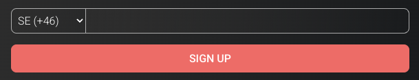

### input-with-country-code-plugin

Input field with country code dropdown which is a WordPress plugin. Upon submitting the data, it will save the data in a database which can later be viewed in the WordPress backend in tabular format and also can be exported in CSV format.

### Screenshot

